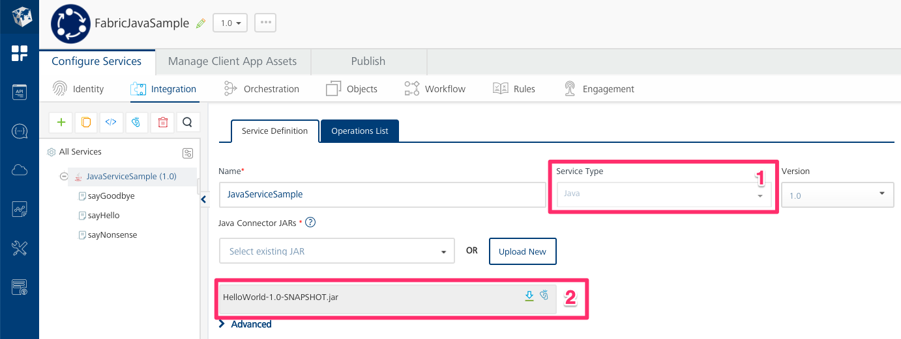
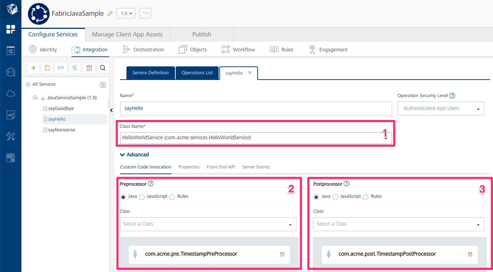

# A Sample Fabric Application with Java Custom Code

A dummy Fabric application showcasing a sample Java service, pre-processor and post-processor.

## Repository Structure

This repo uses a [Monorepo](https://en.wikipedia.org/wiki/Monorepo) approach in order to version
both the Fabric application and the source code for its Java dependencies in the same location.

```
.
├── fabric
│   └── FabricJavaSample
└── java
    └── HelloWorld
```

## The Fabric App

The `fabric/FabricJavaSample` subdirectory stores the Fabric application as it would result from exporting and
extracting the Fabric application into a directory by the same name.

As this is just a *"Hello World"* example, the app itself is not very interesting. **The intent of this project and repository
is to show how to develop, test, version and use custom Java code in Fabric.**

In the image below shows the service definition.



1. The Fabric app has one single service of the ***Java Adapter*** type.
2. The JAR generated from the Java source code in this repository has been uploaded and selected as part of the service
definition.

In the image below shows the definition of one of the service operations:



1. The class `com.acme.services.HelloWorldService` has been selected as the supporting implementation of the service
operation. Note that you should ideally implement each service in a different class.
2. The class `com.acme.pre.TimestampPreProcessor` has been selected as the pre-processor for the service operation.
3. The class `com.acme.pre.TimestampPostProcessor` has been selected as the post-processor for the service operation.

## The Java Dependencies

The `java/HelloWorld` subdirectory stores the source code for a Java project which implements a custom service
`HelloWorldService`, a pre-processor `TimestampPreProcessor` and a post-processor `TimestampPostProcessor` which
are in turn used by the Fabric application stored under `fabric/FabricJavaSample`. It includes:

### Class *com.acme.services.HelloWorldService*

A service with two operations `sayHello` and `sayGoodbye`, and sample code on how to test them.

### Class *com.acme.pre.TimestampPreProcessor*

A pre-processor which adds a `timestamp` parameter and a `x-timestamp` header to a service operation's invocation.

### Class *com.acme.post.TimestampPostProcessor*

A post-processor which adds a `timestamp` parameter to the service operation's outputs.

## How to Build

In short, just run `make`. If you need more info, continue reading.

Notice that `fabric/.gigignore` makes sure that you **don't push into source control any of the Zip or JAR files** that
would result from exporting the app from the Fabric Console and decompressing it. This is meant to help enforce **the
best practice that compressed files and binaries should not go into source control**.

As a consequence, just compressing and importing the contents of `fabric/FabricJavaSample` will not result in a working
Fabric application. You will need to first build the Java dependencies and then add them to the Fabric app bundle before
importing it.

**Steps:**

1. Build the Java project in the `java/HelloWorld` directory. You can do this by stepping into it and running `mvn package`.
2. Copy the resulting JAR file from the `java/HelloWorld/target/` directory to the `fabric/FabricJavaSample/Apps/_JARs/` directory.
3. Compress the `fabric/FabricJavaSample` directory in Zip format.
4. Import the resulting Zip file into the Fabric Console.

The end result just before step #3 should be that your `_JARs` subdirectory looks like this:

```
fabric/FabricJavaSample/Apps/_JARs/
├── HelloWorld-1.0-SNAPSHOT.jar
└── HelloWorld-1.0-SNAPSHOT.meta.json
```

You can do this by running the make file included with this repository. Just open the command line prompt into the root of the repository and run:

```
make
```

You will see the Maven and Zip output, and at the end you'll see this message.

```
Done!
Now import FabricJavaSample.zip into Fabric.
```

As the message states, you can now import `FabricJavaSample.zip` into the Fabric Console. Either manually through the UI, or by using the Fabric CLI.

## Implementation Notes

About the Java dependencies under the `java/HelloWorld` subdirectory:

* The project was created with [IntelliJ](https://www.jetbrains.com/idea/) but you can import it into any other Java IDE of
your choice —e.g. Eclipse, Netbeans, etc— to modify, test and build it there.
* The project uses Maven as a dependency manager. The POM file at `java/HelloWorld/pom.xml` is a good example to use for your
own Java dependencies project if you need one.
* The project uses [TestNG](https://testng.org) as a test automation framework, and [Mockito](https://site.mockito.org/) to
instantiate some of the input parameters that the services, pre-processors and post-processors would receive
from the Fabric server during runtime —i.e.: `com.konylabs.middleware.controller.DataControllerRequest` and
`com.konylabs.middleware.controller.DataControllerRequest`.
